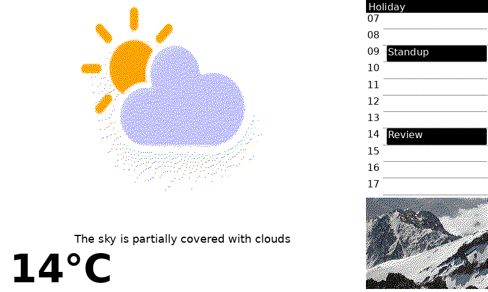

# hass-eink

A Home Assistant custom integration that renders grid-based layouts to PNG and serves them to ESPHome e-ink displays. Each display polls a token-authenticated URL and receives a freshly rendered image on every request.



The example above shows a 3×3 weather widget on the left and a calendar day-view with hourly forecast on the right, rendered on an 800×480 canvas.

## Features

- **Grid layout system** — 3-row × 4-column grid, widgets span multiple cells
- **Weather widget** — current condition with icon, temperature, and localized condition label
- **Calendar widget** — day-view timeline with event bubbles and optional hourly weather forecast column
- **Image widget** — cycles through photos from a Home Assistant media source folder
- **Select entity** — switch the active layout from the HA UI, dashboards, or automations
- **Custom panel** — visual layout editor in the HA sidebar with live preview
- **Localization** — condition labels follow the HA language setting (English and German included)

## Installation

### HACS (recommended)

1. Add this repository as a custom repository in HACS (type: Integration).
2. Install **E-Ink Display**.
3. Restart Home Assistant.

### Manual

Copy `custom_components/eink/` into your HA `config/custom_components/` directory and restart.

## Setup

1. Go to **Settings → Devices & Services → Add Integration** and search for **E-Ink Display**.
2. Enter a display name. A unique token is generated — copy it for your ESPHome config.
3. Open the **E-Ink** panel in the sidebar to configure layouts visually.

## ESPHome configuration

```yaml
http_request:
  useragent: esphome

display:
  - platform: waveshare_epaper   # adjust to your display
    # ... your pins ...
    lambda: |-
      it.image(0, 0, id(eink_image));

image:
  - platform: online_image
    id: eink_image
    url: "http://homeassistant.local:8123/api/eink/YOUR_TOKEN_HERE.png"
    format: PNG
    update_interval: 5min
```

Replace `YOUR_TOKEN_HERE` with the token shown during setup.

## Layout configuration

Layouts are configured visually in the **E-Ink** sidebar panel. Each layout is a named collection of widgets placed on a 3×4 grid. Click any cell to add or edit a widget, then click **Apply** to save.

The underlying JSON format (also accepted directly) looks like this:

```json
{
  "morning": [
    {
      "type": "weather",
      "row": 0, "col": 0,
      "row_span": 3, "col_span": 3,
      "config": { "entity_id": "weather.forecast_home" }
    },
    {
      "type": "calendar",
      "row": 0, "col": 3,
      "row_span": 2, "col_span": 1,
      "config": {
        "entity_id": "calendar.family",
        "forecast_entity": "weather.forecast_home",
        "start_hour": 7,
        "end_hour": 20
      }
    },
    {
      "type": "image",
      "row": 2, "col": 3,
      "row_span": 1, "col_span": 1,
      "config": { "media_content_id": "media-source://media_source/local/Photos" }
    }
  ]
}
```

### Grid reference

```
col:  0    1    2    3
     ┌────┬────┬────┬────┐
row 0│    │    │    │    │
     ├────┼────┼────┼────┤
row 1│    │    │    │    │
     ├────┼────┼────┼────┤
row 2│    │    │    │    │
     └────┴────┴────┴────┘
```

Each cell is 200×160 px. Widgets span multiple cells via `row_span` / `col_span`.

### Widget types

#### `weather`

| Field | Description | Default |
|---|---|---|
| `entity_id` | HA weather entity | `weather.forecast_home` |

#### `calendar`

| Field | Description | Default |
|---|---|---|
| `entity_id` | HA calendar entity | `calendar.home` |
| `forecast_entity` | Weather entity for hourly forecast column (optional) | — |
| `start_hour` | First hour shown | `0` |
| `end_hour` | Last hour shown | `24` |

#### `image`

Fetches a HA media source folder and cycles through images on each render.

| Field | Description | Required |
|---|---|---|
| `media_content_id` | Media source folder ID | ✅ |

## Switching layouts

Each display exposes a `select` entity (e.g. `select.living_room_layout`) that shows the active layout and lets you switch it from the UI or automations:

```yaml
service: select.select_option
target:
  entity_id: select.living_room_layout
data:
  option: "night"
```

### Example automation — switch layout at sunrise/sunset

```yaml
automation:
  - alias: "E-Ink morning layout"
    trigger:
      - platform: sun
        event: sunrise
    action:
      - service: select.select_option
        target:
          entity_id: select.living_room_layout
        data:
          option: "morning"

  - alias: "E-Ink night layout"
    trigger:
      - platform: sun
        event: sunset
    action:
      - service: select.select_option
        target:
          entity_id: select.living_room_layout
        data:
          option: "night"
```

## Development

### Setup

Requires Python 3.13+. Uses [pyenv](https://github.com/pyenv/pyenv) to manage the version.

```bash
pyenv install 3.13
pyenv local 3.13
python3 -m venv .venv
source .venv/bin/activate
pip install -r requirements-test.txt
```

### Dev scripts

Create a `.env` file in the repo root with a [long-lived access token](http://localhost:8123/profile/security):

```bash
echo "HA_TOKEN=your_token_here" > .env
```

Then use the helper scripts:

```bash
# Reload the integration (picks up Python code changes, no HA restart needed)
./scripts/reload.sh

# Restart Home Assistant (needed after manifest.json or translation changes)
./scripts/restart.sh
```

### Running locally

HA Core is installed as part of the test dependencies, so you can run it directly from the venv:

```bash
source .venv/bin/activate
mkdir -p ha-config/custom_components
ln -s $(pwd)/custom_components/eink ha-config/custom_components/eink
hass -c ha-config
```

Open `http://localhost:8123`, complete onboarding, then add **E-Ink Display** via Settings → Integrations.

### Running tests

```bash
pytest tests/ -v
```

Regenerate golden master snapshots after intentional design changes:

```bash
UPDATE_SNAPSHOTS=1 pytest tests/test_snapshot_*.py
```

### Project structure

```
custom_components/eink/
├── __init__.py        # integration setup + eink.set_layout service
├── manifest.json      # HA metadata, Pillow requirement
├── const.py           # constants (domain, grid dimensions, widget types)
├── config_flow.py     # UI config flow (display registration) + options flow
├── coordinator.py     # per-display state: active layout, image rotation index
├── http.py            # GET /api/eink/{token}.png view
├── options_view.py    # GET /api/eink_options/{entry_id} for the panel
├── panel.py           # registers the sidebar panel + static assets
├── renderer.py        # grid layout → PIL Image → PNG bytes
├── select.py          # select entity for layout switching
├── services.yaml      # eink.set_layout service schema
├── strings.json       # UI strings
├── translations/
│   ├── en.json
│   └── de.json
├── widgets/
│   ├── weather.py     # reads HA weather entity, draws condition + temperature
│   ├── calendar.py    # day-view timeline with events and optional forecast
│   └── image.py       # browses HA media source folder, rotates images
└── www/
    └── eink-panel.js  # single-file custom frontend panel
```

## Requirements

- Home Assistant 2024.1+
- `Pillow` (installed automatically)
- Fonts: DejaVu Sans (standard on most Linux systems; falls back to PIL default if missing)
- `librsvg2-bin` — only needed to regenerate weather icons from SVG (`custom_components/eink/icons/generate.sh`)
